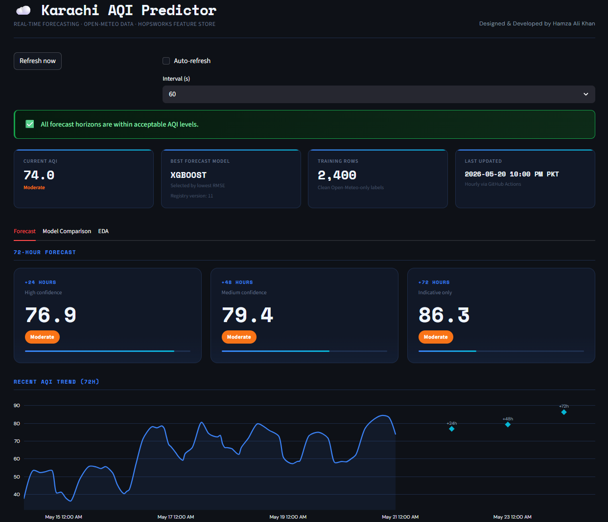
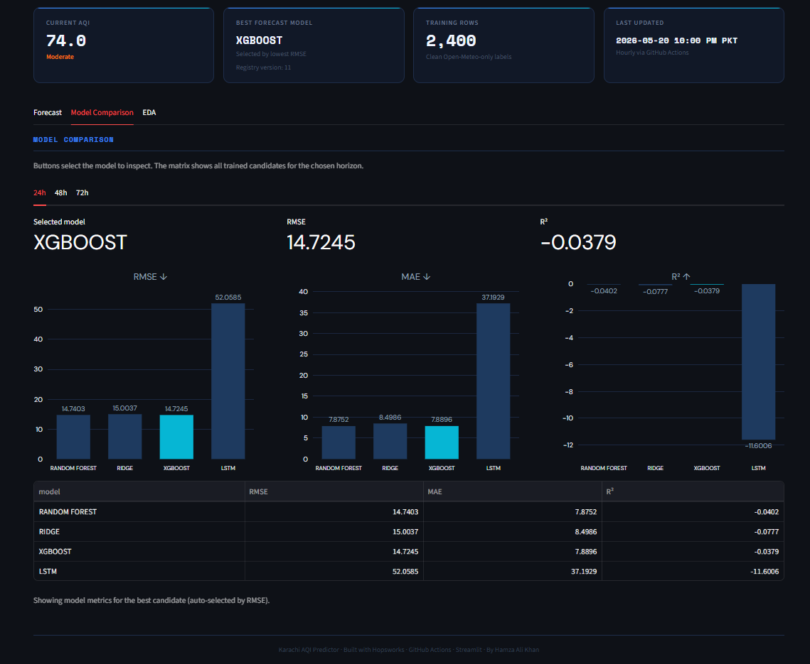
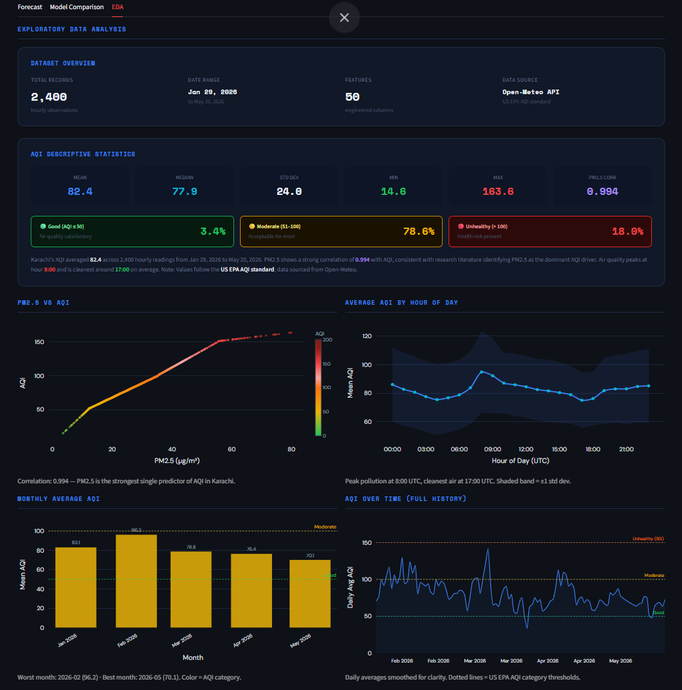

 <p align="center">
    
 </p>

<p align="center">
    
    
    
    
    
</p>

> **Author:** Hamza Ali Khan | **Role:** Data Science Intern
>
> **Goal:** End-to-end, fully serverless ML system that forecasts Karachi's Air Quality Index (AQI) at 24h, 48h, and 72h horizons.

🚀 **Live Demo:** [Karachi AQI Predictor Dashboard](https://karachi-aqi-predictor-yqopnupbu9qh53v3a3wr5v.streamlit.app/)

## Introduction

This repository contains a production-oriented, serverless machine learning system that forecasts Karachi's AQI out to 72 hours. It is intentionally lightweight (four flat pipeline scripts), uses Google Cloud Platform (BigQuery & GCS) as the central data and model layer, and exposes a Streamlit dashboard for visualization and alerting. The project is built for reproducibility and operations: pipelines are runnable locally, CI is provided through GitHub Actions, and models & features are versioned in GCP.

Key points:
- Predictive horizon: 24h, 48h, 72h forecasts (separate models per horizon).
- Data sources: Open-Meteo (weather + pollutant forecasts / history). Historical ground-truth label data was used during earlier experiments — see the PRD for details.
- Feature store & model registry: BigQuery (features) and Google Cloud Storage (models).
- Dashboard: Streamlit (deployed to Streamlit Cloud in production).


## Dashboard screenshots

<div align="center">
    
    <p><em>Forecast overview: 3-day AQI predictions, current AQI badge, and model comparison controls.</em></p>
</div>

---

<div align="center">
    
    <p><em>Model insights: SHAP summary and top feature importances used to explain predictions.</em></p>
</div>

---

<div align="center">
    
    <p><em>Exploratory data analysis: historical AQI trends and pollutant correlation matrices.</em></p>
</div>

---

## Architecture

```
┌──────────────────────────────────────────────────────────────────┐
│                         DATA SOURCES                             │
│      Open-Meteo API (forecast + historical air quality)          │
└────────────────────────────┬─────────────────────────────────────┘
                             │
                             ▼
┌──────────────────────────────────────────────────────────────────┐
│                  4 PIPELINE SCRIPTS (flat file structure)        │
│                                                                  │
│  feature_pipeline.py   → fetch, engineer features, write to BQ   │
│  training_pipeline.py  → train 3 models, save to GCS             │
│  inference_pipeline.py → predict next 24/48/72h                  │
│  backfill_pipeline.py  → historical Open-Meteo backfill          │
└────────────────────────────┬─────────────────────────────────────┘
                             │
                             ▼
┌──────────────────────────────────────────────────────────────────┐
│                     GOOGLE CLOUD PLATFORM                        │
│  BigQuery (Feature Store)  ·  Google Cloud Storage (Models)      │
│  aqi_model_24h · aqi_model_48h · aqi_model_72h                   │
└────────────────────────────┬─────────────────────────────────────┘
                             │
                             ▼
┌──────────────────────────────────────────────────────────────────┐
│              STREAMLIT DASHBOARD (deployed)                      │
│  Real-time forecasts · EDA section · Model comparison tab        │
│  SHAP / LIME explainability · Dark theme cards · Plotly charts   │
└──────────────────────────────────────────────────────────────────┘
                             ▲
                  GitHub Actions CI/CD
              (scheduled pipeline runs)
```

**Key design decisions:**
- Flat 4-script structure over a `src/` package hierarchy — intentional simplicity, easier to debug
- Three separate per-horizon models rather than one multi-output model — cleaner experiment tracking
- Open-Meteo for all features (free, no API key, 7-day forecast + 3-month history)
- BigQuery & GCS selected over Hopsworks due to increased stability and faster ecosystem integrations
- Random Forest selected as best model across all horizons after multi-model comparison


## My Journey — From Idea to Deployed System

### Phase 1 — Design & Setup

Started with the goal of building a real, production-like ML system — not just a notebook. Chose a serverless architecture to avoid Docker/Airflow overhead. Mapped out the data sources: Open-Meteo for meteorological and air quality forecast features. Settled on Google Cloud Platform (BigQuery and GCS) for data storage and model registry after migrating off Hopsworks to improve system stability.

Initially considered OpenWeatherMap as an additional data source but dropped it due to API activation delays. GitHub Actions was chosen for orchestration over Airflow for the same simplicity-first reason.

### Phase 2 — Data Pipeline & Feature Engineering

Built the feature pipeline to pull hourly data from Open-Meteo, engineer lag features (1h, 3h, 6h, 12h, 24h), rolling statistics, and cyclical time encodings (sin/cos for hour and day-of-week), then write everything into BigQuery.

The backfill pipeline pulled 3 months of Open-Meteo historical data to bootstrap the feature store with enough history to train on.

### Phase 3 — The Distribution Shift Crisis (Biggest Setback)

This was the hardest part of the project. After training the initial models, the metrics were catastrophically bad — negative R². After investigation, the root cause was a **data distribution shift**: the synthetic Open-Meteo backfill data had a very different AQI mean than the real label data that came later. The model had effectively learned from two different distributions.

**Fix:** Deleted and rebuilt the feature group entirely — twice — until it contained only clean real data from **2025-03-04 onward**. This single data quality fix had a bigger impact on model performance than any hyperparameter tuning.

**Lesson learned:** Data quality beats model complexity, every time.

### Phase 4 — Model Training & Feature Leakage Discovery

Trained and compared four model types (Ridge, Random Forest, XGBoost, LSTM) on the clean dataset. Initial versions showed suspiciously high R² (~0.92) which was traced to **feature leakage** — `fc_pm25_24h` (PM2.5 forecast) was acting as a direct proxy for the AQI target because PM2.5 mathematically maps to AQI via the US EPA formula. The model was essentially cheating.

**Fix:** Removed `fc_pm25_*` columns from all training features. SHAP charts confirmed the fix — feature importance became balanced across multiple features instead of one bar dominating at 0.95.

After fixing leakage, final honest metrics with Random Forest:

| Horizon | Model | RMSE | R² |
|---------|-------|------|-----|
| 24h | Random Forest | 11.02 | 0.13 |
| 48h | Random Forest | 10.47 | 0.22 |
| 72h | Random Forest | 10.93 | 0.16 |

These numbers are honest. Papers reporting R² ≈ 0.99 for "AQI prediction" are almost always solving a **nowcasting** problem — using same-day inputs to predict same-day AQI — which is fundamentally easier. This project is a genuine **forecasting** problem with no future ground truth available at prediction time.

### Phase 5 — Dashboard & Three Performance Bugs

Deployed a Streamlit dashboard with dark theme cards, Plotly charts, a real EDA section, a model comparison tab across all horizons, and SHAP/LIME explainability. Three bugs hit in production:

**Bug 1 — Model cache TTL too short:** Frequent large model re-downloads degrading performance. Fixed by extending cache TTL to 6 hours.

**Bug 2 — History cache never expiring:** Cache keyed on object reference instead of stable value, so it never refreshed. Fixed by using UTC hour as cache-bust key.

**Bug 3 — Stale "Last Updated" timestamp:** Fixed by reading timestamp directly from sorted history DataFrame instead of a cached variable.

### Phase 6 — The Hopsworks Cluster Crisis (May 21-22, 2026)

The most operationally intense day of the project. A cascade of infrastructure problems hit simultaneously:

**Problem 1 — 19-day zombie job:** A materialization job (execution ID 156010) had been silently running since May 3rd for 18 days 19 hours, holding cluster CPU the entire time. This was the root cause of all scheduling failures — 0/23 nodes available, 10 insufficient CPU.

**Problem 2 — Negative R² returned:** While debugging the cluster, retraining revealed negative R² again. Investigation found two new causes:
- `fc_pm25` leakage (removed)
- Stored lag features being recomputed from scratch using `shift()` over a dataset with 99 timestamp gaps — `shift(-24)` was pointing to 30h, 60h, even 151h ahead instead of exactly 24h

**Fix for negative R²:** Added exact-horizon validation in `build_training_frame` to drop any row where the shifted target timestamp is not exactly `horizon_hours` ahead. Dropped 192/216/240 rows per horizon. R² recovered to positive range.

**Problem 3 — Accidental job deletion:** While attempting to kill the zombie job, the materialization job configuration was accidentally deleted from Hopsworks. The Hopsworks SDK raised `No materialization job was found` on every subsequent insert — even with `start_offline_materialization: False` flag, as the SDK checks for the job regardless.

**Fix:** Deleted and recreated the feature group entirely (third time). Backed up all 2400 rows to CSV first, then recreated with correct schema and reinserted. Materialization job auto-created on first insert.

**Problem 4 — Schema type mismatch after recreation:** The CSV backup stored `hour_of_day`, `day_of_week`, `month` as `int32` but Hopsworks inferred `bigint` during recreation. Fixed by casting to `int64` before insert.

### Phase 7 — CI/CD

GitHub Actions configured for scheduled pipeline runs. Kept disabled during active local debugging — local-first, CI/CD second. Re-enabled after all pipeline fixes were stable and pushed to GitHub.


## Challenges & How I Managed Them

| Challenge | Root Cause | Resolution |
|-----------|-----------|------------|
| Negative R² after initial training | Distribution shift — synthetic backfill data vs. real data had very different AQI means | Deleted and rebuilt feature group twice; kept only clean data from 2025-03-04 onward |
| Suspiciously high R² (~0.92) | Feature leakage — `fc_pm25_24h` directly maps to AQI target via EPA formula | Removed all `fc_pm25_*` columns from training features; SHAP confirmed balanced importance |
| Negative R² returned after fc_pm25 removal | 99 timestamp gaps in data caused `shift(-24)` to point to wrong future timestamps (30h, 60h, 151h ahead instead of 24h) — corrupted training targets | Added exact-horizon validation in `build_training_frame`; dropped 192/216/240 corrupted rows per horizon; R² recovered |
| Stored lags being recomputed incorrectly | `build_training_frame` was calling `add_engineered_features()` which recomputes lags via `shift()` — destroying the correctly stored lag values | Fixed to use pre-computed lag columns from Hopsworks directly when they exist |
| Hopsworks cluster unavailable all day | 19-day zombie job (execution 156010) held CPU since May 3rd; killed jobs left ghost pods at Kubernetes level not visible in UI | Found and killed the zombie job; reduced Spark resources (4GB→1GB executor); recreated feature group to reset job state |
| Materialization job accidentally deleted | Attempted to kill zombie job, deleted entire job config instead | Backed up 2400 rows to CSV, deleted and recreated feature group, reinserted all data — job auto-recreated |
| Schema type mismatch after recreation | CSV backup stored int columns as int32 but Hopsworks inferred bigint during recreation | Cast `hour_of_day`, `day_of_week`, `month` to int64 before insert |
| `hours_since_prev`/`is_gap` schema error | New diagnostic columns added to pipeline but not registered in feature group schema | Drop columns before insert with `errors='ignore'` |
| Hopsworks pipeline hanging for 30+ min | Stuck Spark job — didn't fail cleanly, just hung indefinitely | Manually killed via UI, re-triggered; reduced Spark memory allocation |
| Dashboard model re-downloads too frequent | Cache TTL set too short | Extended model cache TTL to 6 hours |
| History cache never refreshing | Cache keyed on object reference instead of stable value | Re-keyed cache on UTC hour |
| Stale "Last Updated" timestamp | Reading from cached variable instead of live data | Read timestamp directly from sorted history DataFrame |
| OpenWeatherMap API never activated | Provider-side delay | Dropped entirely; Open-Meteo covers all needed features for free |
| R² misinterpretation risk | Papers show ~0.99 but solve nowcasting, not forecasting | Documented the distinction clearly; honest reporting of metrics |

---


## Key Learnings

1. **Fix your data before tuning your model.** The distribution shift fix gave a larger R² improvement than any model change.
2. **Nowcasting ≠ Forecasting.** R² of 0.22 for a 24h-ahead cold-start AQI forecast is legitimate. Don't benchmark against papers solving a different problem.
3. **Timestamp gaps corrupt shift-based targets.** `df.shift(-24)` does not guarantee a 24h-ahead target if hourly data has gaps — it just shifts by row index. Always validate `target_timestamp - current_timestamp == horizon_hours` before training.
4. **Feature leakage isn't always obvious.** `fc_pm25` looked like a legitimate forecast feature but was mathematically equivalent to the target via the EPA formula. High R² is a red flag, not a green one.
5. **Simple architecture is a feature.** Four flat scripts beat a complex package hierarchy for a project of this scope.
6. **Operational bugs are real bugs.** Cache TTL, stuck jobs, zombie pods, and stale timestamps are production problems that matter just as much as model metrics.
7. **Always backup before deleting.** Feature group deletions are irreversible. CSV backup saved 2400 rows from being permanently lost.
8. **Serverless shared infrastructure has limits.** Free tier Hopsworks is shared — a single zombie job can block your entire project for a day. Reduce Spark resource requests to minimum viable to compete fairly on shared clusters.


## Final Model Metrics

| Horizon | Model | RMSE | R² |
|---------|-------|------|-----|
| 24h | Random Forest | 9.818 | 0.2997 |
| 48h | Random Forest | 9.588 | 0.3297 |
| 72h | Random Forest | 10.308 | 0.2336 |


> *Dataset: 2026-01-30 → 2026-05-24 (92-day rolling window)
>
>Clean rows after gap filtering: ~1700 per horizon | Features: 29-34 per horizon | Models: Random Forest | Registry: GCS*

## Dependencies & Run (local)

Follow these steps to set up the project locally and run pipelines or the dashboard. These instructions assume a Windows development machine (PowerShell) and a Python 3.10+ environment.

1. Create and activate a virtual environment:

```powershell
python -m venv .venv
.\.venv\Scripts\Activate.ps1
```

2. Install Python dependencies:

```powershell
python -m pip install --upgrade pip
pip install -r requirements.txt
```

3. Create a `.env` from the example and add required secrets (local testing only):

```powershell
copy .env.example .env
# Edit .env and populate GCP credentials
# GOOGLE_CLOUD_PROJECT=aqi-predictor-497110
# GOOGLE_CLOUD_REGION=us-central1
# GOOGLE_APPLICATION_CREDENTIALS=gcp-key.json
```

4. Run pipelines locally (examples):

```powershell
# Feature pipeline (fetch + write features to BigQuery)
python feature_pipeline.py

# Backfill (one-time historical run)
python backfill_pipeline.py --start 2024-11-01 --end 2025-03-01

# Training pipeline (train + save models to GCS)
python training_pipeline.py
```

5. Run the Streamlit dashboard locally:

```powershell
streamlit run streamlit_app.py
```

Notes:
- CI (GitHub Actions) runs the same scripts in a cloud environment — make sure secrets are in GitHub Secrets.
- Replace with: "Set GCP credentials in .env (local) and GitHub Secrets (CI)"
